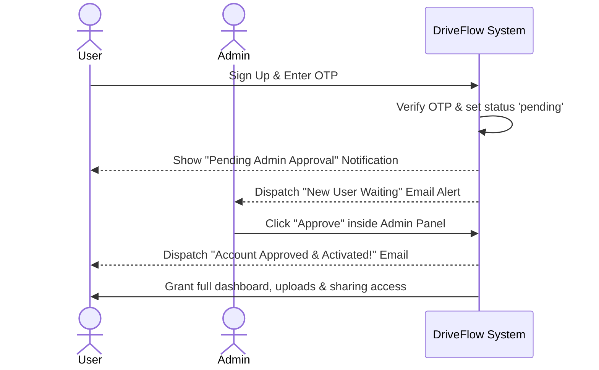

# 📁 DriveFlow: Premium Hybrid Private Cloud Sync & Document Management Suite

[](https://nextjs.org)
[](https://nodejs.org)
[](https://mongodb.com)
[](https://cloud.google.com)
[](https://capacitorjs.com)

DriveFlow is a high-performance, **zero-cost enterprise-grade private cloud suite** that integrates Google Drive API with MongoDB Atlas to deliver an independent file storage, search, and sharing hub. Encapsulated in a **Next.js frontend** and **Express.js backend**, DriveFlow functions seamlessly across modern web portals and native Android environments using **Capacitor**.

---

## 🚀 Key Feature Highlights

### ⚡ **High-Speed & Resumable Direct Uploads**
* Integrated **resumable Google Drive upload proxy pipeline** that bypasses browser CORS limits and enables seamless multi-gigabyte uploads without memory leaks.

### 👥 **Manual Admin Approval Lifecycle**
* **Gatekeeper Protocol:** New registrations are automatically held in a `pending` state. Admins receive email alerts to manually approve or reject users, maintaining absolute access control.

### 🔒 **Airtight Security & Data Hygiene**
* Secure JWT verification, standardized **Bcrypt password hashing (10 rounds)**, and **cryptographically secure Node.js pseudo-random OTPs (`crypto.randomInt`)** for email validations.

### 📝 **Audit Trial & Activity Logging**
* Detailed, chronological system logs recording all file uploads, renames, deletions, restorations, and user status toggles for administrative audits.

### 📱 **Dynamic Native Mobile Shell**
* Native Android build using **Ionic Capacitor** featuring dynamic auth boot detection, smooth launching transitions (0-100%), hardware-level back-button interception for forced updates, and direct native APK downloads.

---

## 🛠️ Technology Stack

| Layer | Technologies |
| :--- | :--- |
| **Frontend** | React 18, Next.js (App Router), Framer Motion, Lucide Icons, Vanilla CSS Variables |
| **Backend** | Node.js, Express, Mongoose, Axios, JWT (`jsonwebtoken`), Multer |
| **Storage Engine** | Google Drive v3 API (Google Cloud Integration) |
| **Database** | MongoDB Atlas Cloud (Free M0 Cluster) |
| **Mobile Shell** | Ionic Capacitor Android, Gradle Builder, SDK 34 |
| **Deployments** | Vercel (Frontend Client & Mail Relay), Render (Backend Service) |

---

## 📊 Architectural Workflow

### User Registration & Approval Pipeline



---

## ⚙️ Environment Variables Setup

Create a `.env` file in the `backend/` directory and configure the variables below.

```env
PORT=5000
MONGODB_URI=your_mongodb_atlas_connection_string
JWT_SECRET=your_secure_jwt_secret_token
API_SECRET_KEY=your_vercel_email_relay_security_key

# Google Drive API Cloud Credentials
GOOGLE_CLIENT_ID=your_google_oauth_client_id
GOOGLE_CLIENT_SECRET=your_google_oauth_client_secret
GOOGLE_DRIVE_FOLDER_ID=your_managed_google_drive_folder_id
GOOGLE_REFRESH_TOKEN=your_google_refresh_token

# Email Mailer SMTP Configuration
MAILER_EMAIL=bott27124@gmail.com
MAILER_PASS=your_gmail_16_character_app_password
ADMIN_NOTIFICATION_EMAIL=rupambairagya08@gmail.com

# Mobile App Versioning & Forced Update Configuration
LATEST_APP_VERSION=1.0.5
MIN_REQUIRED_VERSION=1.0.5
APP_DOWNLOAD_URL=https://drive.google.com/file/d/your_apk_gdrive_download_link/view
```

---

## 💻 Local Quickstart Guide

### 1. **Prerequisites**
Ensure you have **Node.js v18+** and **Git** installed on your workstation.

### 2. **Backend Setup & Run**
```bash
# Navigate to the backend directory
cd backend

# Install production and development dependencies
npm install

# Start the local development server
npm run dev
```

### 3. **Frontend Setup & Run**
```bash
# Open a new terminal and navigate to the frontend directory
cd frontend

# Install UI assets & dependencies
npm install

# Start the Next.js Turbo development server
npm run dev
```

---

## 📱 Compiling the Native Android Application

To package, compile, and sync the hybrid mobile APK, run the following commands:

```bash
# Navigate to the frontend directory
cd frontend

# 1. Compile and bundle Next.js production files
npm run build

# 2. Synchronize web assets into the Android native platform
npx cap sync

# 3. Open the Android native project folder
cd android

# 4. Assemble the Android production/debug APK
./gradlew.bat assembleDebug
```
The compiled, production-ready Android APK will be generated at:
`frontend/android/app/build/outputs/apk/debug/app-debug.apk`

---

## 🛡️ Security Best Practices & Maintenance

1. **Environmental Secrets Isolation:** Never commit the `.env` file or local `app-debug.apk` files. Ensure they remain safely inside the `.gitignore` exclusion array.
2. **SMTP Gmail Integration:** If email volumes exceed **500 dispatches per day**, update the Nodemailer transporter configuration from Gmail App Passwords to dedicated transaction engines like **Resend** or **SendGrid**.
3. **Storage Scaling:** If your Google Drive 15GB limits are reached, simply link a new free Gmail account, obtain the refresh token, swap it inside the backend environmental variables, and instantly gain another 15GB!
